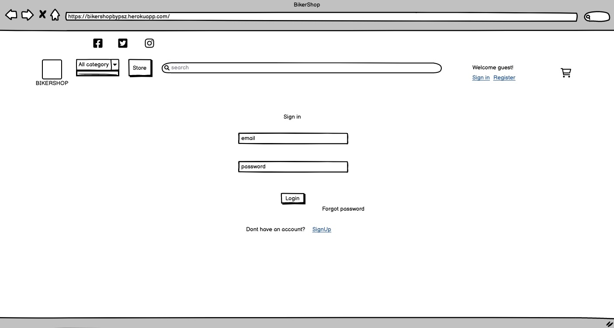

I couldn’t finish my project.

My DEBUG=True.  if is it False got server 500 error 

The deployed site didn’t load static files correctly

Email sending not working(registration, order received)

Readme not ready

Must tidy my code

Fix my images (name, size, add more to some categories)

Add variations to my products

Add FAQ

# BikerShop

## Readme

### Table of contents:

[Theme, Epic and User Stories](#theme-epic-and-user-stories) 

[Design](#design) 
* [Wireframes](#wireframes)

[Features](#features)

[SEO](#seo)

[Technologies](#technologies)

[Testing ](#testing)

[Debugging and known bugs](#debugging-and-known-bugs)

[Deployment](#deployment)

[Resources](#resources)

[Acknowledgements, Credits](#acknowledgements-credits)

# BikerShop

### The live website can be seen [here](https://bikershopbypsz.herokuapp.com/)

### Theme, Epic and User Stories

#### Theme

To sell motorcycle clothes and new, used parts online.

#### Epic

This website will provide the user to buy everything what can belongs a motorcycle owner. Protective and casual clothes, new, used, one of a kind parts. The website will be simple and easy to use; a good experience for the user that will make their time in the shop welcoming. 

#### Overall Goals
* Create an e-commerce cloud-hosted Full-Stack web application to sell motorcyle-riding related products online.
* Allow users access to full CRUD (create, read, update and deleted) functionality on user profile.
* To provide users with a targeted product selection and smooth customer experience when shopping on BikerStore.

#### Agile
The Agile Methodology was used to plan this project. This was implemented through Github and the Project Board which can be seen here  

Through the use of the Kanban board in the projects view in Github, the project was divived into a few different sections:
* Backlog
* Current Iteration
* In Progress
* Done

### User stories

As a **user/owner**, I can **sign in and out intuitively** so that **I can use the website easily**.

As a **user/owner**, I can **navigate the website easily and intuitively** so that **I can explore the website freely**.

#### User

As a **user**, I can **clearly see the products of the site when I land on the home page** so that **I stay on the site**.

As a **user**, I can **clearly understand the products I am considering purchasing** so that **I can make informed decisions**.

As a **user**, I can **get an instant quote for the products** so that **I know how much I will be spending**.

As a **user**, I can **complete the payment process quickly and easily** so that **I don’t get distracted/dissuaded and leave**.

As a **user**, I can **be notified by email when my order has been placed successfully,** so that **I have trust in the website and I have the order details in a convenient place**.

As a **user**, I can **have the option for my information to be saved for future purchases** so that **I can save time on future purchases**.

As a **user**, I can **edit my user information** so that **I can have the correct information**.

As a **user**, I can **easily find the site's privacy policy and other important information** so that **I can use the site knowing I am protected**.

As a **user** I can **update the shopping bag** so that **I can keep track of my shopping while I browse the site**.

As a **user** I can **view my order history** so that **I know what I have already ordered**.

As a **user** I can **write rewievs** so that **I can help to decide for other users**.

#### Owner

As a **owner**, I can **control stock levels** so that **I can control the amount of products I sell**.

As a **owner**, I can **be notified if an order comes in** so that **I can action the sale**.

As a **owner**, I can **view all orders placed on the site and see the current order status** so that **I know if there is an order I have to process**.

As a **owner** I can **change the status of an order** so that **I can communicate to other staff that the order has been actioned**.

As a **owner**, I can **easily provide the site privacy policy** so that **I can communicate with users and increase the legitimacy of my website**.

As a **owner**, I can **use web marketing** so that **I can increase website traffic and sales**.

As a **owner** I can **edit/delete rewiews** so that **users can see the correct information**.

As a **owner**, I will **be provided with search engine optimisation for my site** so that **I can receive increased traffic and sales**.

As a **owner** I can **easily edit product requests** so that **I can make changes without a lengthy back and forth of emails**.

### Design

The main goal was an easy simple website.Matching design as a popular Facebook site.
Main colurs are white and blue.

### Wireframes

Home page

Shop page

Login page

Register page

Shopping bag page

Chekout page

Product detail page

User profile page

### Features

Home page

Navbar 

Store page

Product detail page

Shopping cart

Review

Checkout

Place order

PayPall payment

Dashboard

Order detail

### SEO
Google keyword research was used to optimise web pages and content to increase ranking in search engines. Both short-tail & Long-tail keywords are used. The “People also ask” and “Related searches” was also used to identify keywords used.

### Marketing

### User Needs

B2C business:

Questions asked:

What do your users need?

A clothes/parts for motorcycle riding.

What information and features can you provide to meet those needs?

A clear display of clothes, parts, choices and prices. Easy and straightforward to purchase products.

How can you make the information easy to understand?

Intuitive and clear design, high quality clear images, clear and descriptive titles, simple payment process, simple signup/login/logout process.

How can you demonstrate expertise, authoritativeness and trustworthiness in your content?

Pages including Reviews about products and Privacy Policy, chance to subscribe.

Would there be other pages within your own site you could link to from your chosen page?

Home page, nav bar, custom product pages would also link back to primary shop page. Error pages also link back to shop page.

Are there opportunities to link back to external websites that already rank highly on Google?

Who are your users?
Bikers, motorcycle enthusiast.

### Marketing Strategies

Which online platforms would you find lots of your users?

Social media -  Facebook, if the shop gains more staff could possibly reach into other platforms, like Instagram, Twitter.

### Technologies

Python 
HTML
CSS3
Javascript
Django 
Bootstrap 
Cloudinary
ElephantSQL
GitHub
Heroku
Gitpod
Balsamiq
Photos by Apple
amiresponsive
Google Chrome Devtools

### Testing

#### Code Validation

[Python validator](https://infoheap.com/python-lint-online/)

Python is valid

[Javascript validator](https://jshint.com/)

No Error Found

[CSS validator](https://jigsaw.w3.org/css-validator/)

No Error Found

### Lighthouse Testing

Testing was conducted using Google Chrome Devtools Lighthouse

### Manual Testing

I sent the live link to friends and family members for testing and feedback. The site was received positively; design and usability suggestions were considered and acted on.

### Debugging and known bugs

### Deployment

#### Publishing
The project was deployed using Heroku. The process is as follows:

Once you have signed up to Heroku, on the top right of the dashboard there is a button labelled 'New'. This will open a dropdown; please select 'Create new app'. On the next page you can choose your region and a name for the project. Then click 'Create app'.

On the next page there is a menu along the top. Navigate to 'Settings', where you will find the config vars. Scroll down to the section named 'Config vars' and click on the button labelled 'Reveal config vars'. Cloudinary and ElephantSQL will both need config vars as per your own details. You will also need to set a secret key. Once the config vars are saved, back in Gitpod save them in an env.py file. Make sure to add env.py to your .gitignore list so that your config vars do not become publically available on Github.

If you scroll back to the top of the page you will find the 'Deploy' tab, which has multiple options for deployment. I used Github for this project. When you click on the Github button a bar will come up for you to search for the repo you wish to connect to.

Once you have connected, you have the option to deploy automatically (the app will update every time you push) or manually (update only when you choose). I chose automatic but you can do what suits you.

After the first push/update, your app will be ready to go!

#### Forking and Cloning

To save a copy of the code and work on it yourself, here are the steps for forking and cloning using Github:
In the repository, click the 'Fork' button, which is on the top right-hand side, next to 'Star'.

Github will automatically create a new repo, which is forked from the original. If you would like to clone it you have two options:
Within the repository, click the 'Code' dropdown, which is located next to 'Add File' on the right (underneath the Settings tab); there is an option to download all files and save a copy locally.

In the same 'Code' dropdown, you can opt to open the code with GitHub Desktop and work from there.

### Resources

[Django documentation](https://docs.djangoproject.com/en/4.0/)

[Bootstrap 4 documentation](https://getbootstrap.com/docs/4.6/getting-started/introduction/)

[Cloudinary documentation](https://cloudinary.com/documentation)

Privacy Policy generated from (https://www.privacypolicygenerator.info)[Privacy Policy Generator].

# Acknowledgements, Credits

  ### There would have been no submission without the following people:
   * Everyone in the Slack community and my cohort class, especially: Ronan McGill, Owen Darcy and Claudio Crocilla
   * My mentor Spencer Barriball : for his endless knowledge, patience and advice
   * My friends and my family
   * Rathan Kumar - Django Ecommerce used his code 
   * I Think Therefore I Blog, Boutique Ado from Code Institute 